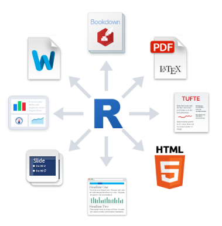

## RStudio

RStudio offers multiple advantages compare to the normal terminal / command line 

<font color="#3366ff">
<b> source codes, STDOUT, images and results are in the same windows. </b>
</font>


---

## RStudio

RStudio offers multiple advantages compare to the normal terminal / command line 


> - Open source
> - It runs on every OS and there is a <font color="#3366ff">server version</font>
> - Various features adn add-ons to increase efficiency. 
> - Continuously under development but very stable. 


---

## RStudio

RStudio offers multiple advantages compare to the normal terminal / command line 

> - using the projects in RStudio you can isolate code and results from different projects.	
> - Restart where you left off.
> - Have all the output under one roof (the R environment,  the object, the plots, etc. )
> - it can automatically creates documentation of your results, comments etc.
> - can creates html, pdf  or word documents
> - presentations are also possible

---.segue bg:grey

## Creating presentation using RStudio

---

## ioslides

- based on the [rmarkdown](http://rmarkdown.rstudio.com/) language.



-it has several layouts and advanced options. 

--- 
## ioslides

<b> header </b> 

```{r, eval=FALSE}
---
title: "Introducing Shiny and RStudio"
author: "Assa Yeroslaviz - Dept. Computational Biology"
output: 
  ioslides_presentation:
        widescreen: true
        transition: faster
---
```

---

## ioslides

<b> Slide with Bullets </b>

- Bullet 1
- Bullet 2
- Bullet 3

---

## ioslides

<b> Slide with R Output </b>

```{r cars, echo = TRUE}
summary(cars)
```

---

## ioslides

<b> Slide with Plot </b>

```{r, fig.height = 3, fig.width = 5, fig.align = 'center', message=FALSE, warning=FALSE}
library(ggplot2)

sizes <- expand.grid(size = (0:3) * 2, stroke = (0:3) * 2)
ggplot(sizes, aes(size, stroke, size = size, stroke = stroke)) + 
  geom_abline(slope = -1, intercept = 6, colour = "white", size = 6) + 
  geom_point(shape = 21, fill = "red") +
  scale_size_identity()
```

---  .class #id

## slidify

advanced possibilities for interactive presentations

for more information see [slidify](http://slidify.org/) (http://slidify.org/)

similar functionality as Latex


--- 

## Install packages

- `Slidify` works in R, so you need to download [that](http://cran.r-project.org) if you haven't yet.
- You also need to make sure you have all of the necessary dependencies installed on your computer
- Open R and copy and paste the following code into the console (you only need to do this once)

```{r, eval=FALSE}
install.packages("devtools")  
install_github('slidify', 'ramnathv')  
install_github('slidifyLibraries', 'ramnathv')
```

--- .segue .dark 

<q> <font color="white"> A framework is a collection of stylesheets, javascripts and layouts that control the style and appearance of a slide deck. </font> </q>


--- .centrepre &vcenter bg:lightgoldenrodyellow

## frameworks

    ---
    title: Frameworks
    framework: revealjs
    mode: selfcontained
    ---
     
    ## Slide 1
     
    Some content
     
    --- 
     
    ## Slide 2
     
    Some content

--- 

## frameworks

<iframe src='./demos/frameworks/solarized/index.html'></iframe>

---

## frameworks

<iframe src='./demos/frameworks/vertical/index.html'></iframe>

---

## Publishing

slidify allows the user to directly publish or share the results as well as the analysis method via different repositories.
This is easily done with e.g. 

- [github](github.com)
- [rpubs](rpubs.com)
- [dropbox](dropbox.com)

```{r}
library(slidify)
publish_github("myDeck", username="frymor")
```


--- &twocol

## 

### Two Columns

This text should span the entire slide.

*** =left

## Left

This text should float to the left.

*** =right

## Right

This text should float to the right.

---

## Read-And-Delete

1. Edit YAML front matter
2. Write using R Markdown
3. Use an empty line followed by three dashes to separate slides!

--- .class #id 

## creates a presentation


slidify


